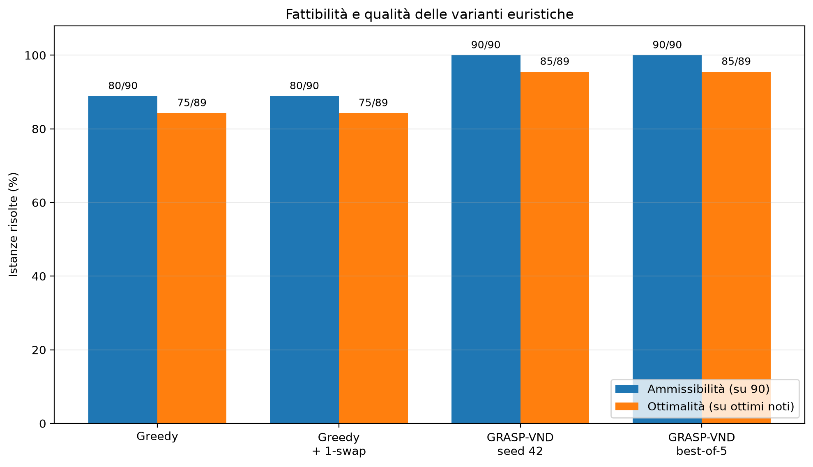
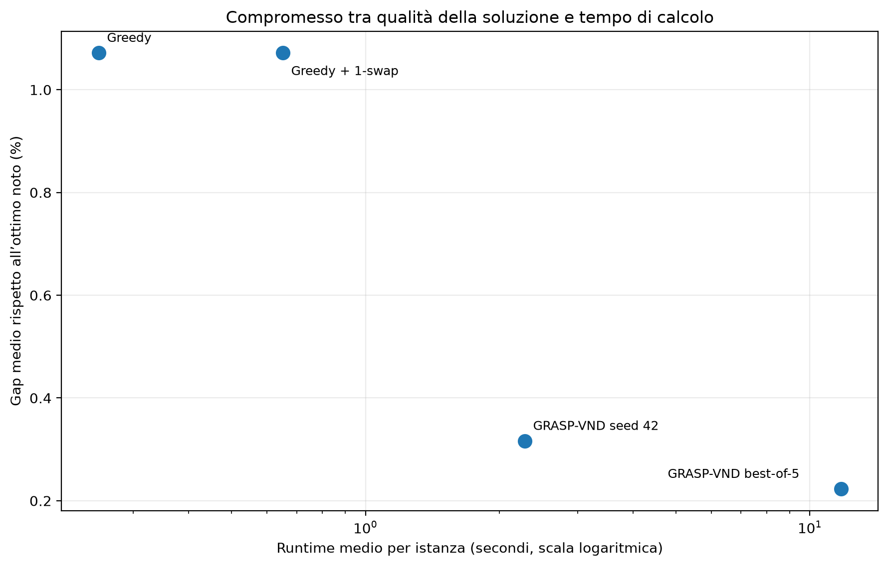

# CMMOFLP Nuclear Siting

**Versione del progetto: 1.0.0**

[](https://github.com/BestOfTorac/CMMOFLP-Nuclear-Siting/actions/workflows/tests.yml)

> **Come garantire energia senza chiedere a una singola comunità di sopportare da sola il rischio maggiore?**

La localizzazione di una centrale nucleare non è soltanto un problema tecnico. Ogni scelta coinvolge sicurezza, territorio, popolazione e responsabilità verso le generazioni future. Quando un’infrastruttura è necessaria ma potenzialmente indesiderabile, non basta trovare una soluzione efficiente: occorre rendere esplicito **chi beneficia della decisione e chi ne sostiene il rischio**.

Questo progetto studia il **Capacitated Multiple Maximin Obnoxious Facility Location Problem (CMMOFLP)** applicato alla localizzazione discreta di centrali nucleari. L’obiettivo maximin protegge il caso peggiore: tra tutte le comunità e tutte le centrali aperte, si cerca di massimizzare la distanza minima di sicurezza.

Il modello non pretende di decidere al posto delle persone. Vuole invece offrire uno strumento trasparente e verificabile, capace di rendere misurabili criteri, compromessi e conseguenze di una scelta territoriale complessa.

Il progetto è stato sviluppato per il corso di **Algoritmi e Modelli per l’Ottimizzazione Discreta (AMOD)** dell’Università degli Studi di Roma Tor Vergata.

> **Nota:** le istanze utilizzate sono sintetiche. La distanza euclidea rappresenta una misura semplificata di sicurezza e il progetto non costituisce una proposta reale di localizzazione di centrali nucleari.

---

## Il problema

Sono dati:

- un insieme di comunità con domanda energetica;
- un insieme di siti candidati;
- la capacità produttiva associata a ciascun sito;
- un numero prefissato $p$ di centrali da costruire.

Ogni comunità deve essere assegnata a una sola centrale aperta e le capacità produttive devono essere rispettate.

Per un insieme di siti aperti $S$, il valore della soluzione è:

```math
z(S)=\min_{j\in S}\min_{i\in I}d_{ij}.
```

L’obiettivo è massimizzare $z(S)$, cioè la distanza minima tra una comunità e una qualsiasi centrale costruita.

L’**assegnamento energetico** serve a verificare la fattibilità rispetto alle capacità. La **sicurezza territoriale** dipende invece da tutte le centrali aperte, non soltanto dalla centrale assegnata a ciascuna comunità.

> **Idea chiave:** l’assegnamento determina la fattibilità; l’insieme dei siti aperti determina la sicurezza.

---

## Metodi implementati

| Metodo | Tipo | Ruolo |
|---|---|---|
| Modello Compact | PLIM esatta in AMPL | Risoluzione e certificazione dell’ottimo |
| Metodo Threshold | Sequenza di problemi esatti di fattibilità | Verifica indipendente sulle istanze piccole |
| Greedy capacitata | Euristica costruttiva | Baseline rapida |
| Greedy + 1-swap | Euristica migliorativa | Baseline con ricerca locale |
| GRASP-VND | Metaeuristica multi-start | Metodo euristico principale |

GRASP-VND combina:

- costruzione randomizzata mediante Restricted Candidate List;
- controllo della capacità raggiungibile;
- assegnamento best-fit;
- repair capacitato;
- cache degli assegnamenti;
- VND con 1-swap e 2-swap mirato;
- arresto per stagnazione e time limit;
- certificazione tramite upper bound quando possibile.

---

## Risultati principali

La campagna finale comprende **90 istanze**, suddivise tra:

- dimensioni `medium`, `large` e `xlarge`;
- distribuzioni `uniform` e `clustered`;
- capacità `tight`, `medium` e `loose`;
- cinque repliche per classe.

| Indicatore | Risultato |
|---|---:|
| Incumbent trovati dal Compact | 90/90 |
| Ottimi certificati dal Compact | 89/90 |
| Run GRASP-VND ammissibili | 449/450 |
| Istanze ammissibili con GRASP-VND best-of-5 | 90/90 |
| Ottimi noti raggiunti da GRASP-VND best-of-5 | 85/89 |
| Errori software nella campagna finale | 0 |

Le capacità `tight` rappresentano il principale fattore di difficoltà. La local search 1-swap applicata isolatamente non ha migliorato la Greedy, mentre GRASP-VND ha aumentato sensibilmente robustezza e qualità grazie alla combinazione di diversificazione, repair e ricerca locale.

Un’unica istanza del benchmark finale, `xlarge_uniform_tight_004`, non è stata certificata dal Compact entro il limite temporale. In questo caso GRASP-VND ha prodotto una soluzione migliore dell’incumbent esatto disponibile, senza però poter dimostrare l’ottimalità.

### Sintesi visiva





L’analisi completa e gli altri grafici sono disponibili in [`docs/results.md`](docs/results.md).

---

## Documentazione

Il punto di accesso principale è:

- [Indice della documentazione](docs/index.md)

Documenti essenziali:

- [Problema e formulazione](docs/problem.md)
- [Modelli matematici esatti](docs/mathematical_models.md)
- [Euristiche](docs/heuristics.md)
- [Istanze e generatore](docs/instances.md)
- [Protocollo sperimentale](docs/experiments.md)
- [Risultati](docs/results.md)
- [Note di implementazione](docs/implementation_notes.md)
- [Soluzione della toy instance](docs/toy_instance_solution.md)

Documentazione operativa:

- [Guida agli script](scripts/README.md)
- [Guida alle configurazioni](configs/README.md)
- [Modelli AMPL](models/README.md)
- [Organizzazione dei risultati](results/README.md)
- [Struttura del package Python](src/cmmoflp_nuclear_siting/README.md)
- [Suite di test](tests/README.md)

---

## Struttura del repository

```text
.
├── configs/        configurazioni del benchmark e delle campagne sperimentali
├── docs/           problema, modelli, euristiche, esperimenti e risultati
├── instances/      toy instance e istanze generate
├── models/         modelli matematici AMPL
├── results/        risultati ufficiali, aggregazioni e grafici
├── scripts/        comandi per generazione, esecuzione e analisi
├── src/            package Python con il codice del progetto
└── tests/          test automatici
```

Il codice riutilizzabile si trova in `src/cmmoflp_nuclear_siting/`, mentre `scripts/` contiene i comandi da eseguire dalla radice del repository.

---

## Requisiti

### Funzioni Python ed euristiche

- Python 3.10 o successivo;
- dipendenze elencate in `requirements.txt`.

### Metodi esatti

Per eseguire il modello Compact e il metodo Threshold sono inoltre necessari:

- AMPL;
- un solver MIP compatibile, utilizzato nel progetto con Gurobi;
- licenze configurate localmente.

Nessuna licenza o credenziale è inclusa nel repository.

---

## Installazione

### Windows — Prompt dei comandi

```cmd
python -m venv .venv
.venv\Scripts\activate
python -m pip install --upgrade pip
python -m pip install -e ".[dev]"
python -m pytest -W error::FutureWarning
```

### Linux/macOS

```bash
python3 -m venv .venv
source .venv/bin/activate
python -m pip install --upgrade pip
python -m pip install -e ".[dev]"
python -m pytest -W error::FutureWarning
```

---

## Avvio rapido

### Validare la toy instance

```bash
python scripts/check_instance.py instances/test/toy_instance_01.json
```

### Eseguire la Greedy

```bash
python scripts/run_greedy.py
```

### Eseguire Greedy + 1-swap

```bash
python scripts/run_local_search.py
```

### Eseguire GRASP-VND

```bash
python scripts/run_grasp_vnd.py \
  --instance instances/test/toy_instance_01.json \
  --seed 42 \
  --starts 25 \
  --stagnation-starts 20 \
  --time-limit 5
```

Su Windows `cmd`, lo stesso comando può essere scritto su una sola riga.

---

## Riproduzione del benchmark finale

### Generare le 90 istanze

```bash
python scripts/generate_instances.py \
  --config configs/benchmark/final_benchmark.yaml
```

### Eseguire le baseline

```bash
python scripts/run_baseline_benchmark.py \
  --manifest instances/generated/final_benchmark/manifest.csv \
  --output results/raw/final_heuristics.csv
```

### Eseguire GRASP-VND con cinque seed

```bash
python scripts/run_grasp_vnd_benchmark.py \
  --manifest instances/generated/final_benchmark/manifest.csv \
  --output results/raw/final_grasp_vnd.csv \
  --algorithm-seeds 42 123 2026 31415 98765 \
  --starts 100 \
  --stagnation-starts 20 \
  --time-limit 20
```

### Eseguire il modello Compact

```bash
python scripts/run_exact_benchmark.py \
  --manifest instances/generated/final_benchmark/manifest.csv \
  --output results/raw/final_exact.csv \
  --methods compact \
  --time-limit 60
```

### Rigenerare analisi e ablation

```bash
python scripts/analyze_final_results.py
python scripts/analyze_ablation.py
```

La campagna completa richiede AMPL e Gurobi per il metodo esatto. Le istanze generate localmente e gli output intermedi non vengono versionati automaticamente.

In alternativa, le operazioni principali possono essere richiamate tramite il `Makefile`:

```bash
make test
make analysis
make plots
make check
```

---

## Autori

- Valerio Torac
- Ali Shalby

---

## Stato del progetto

La formulazione, l’implementazione algoritmica, la generazione delle istanze, la campagna sperimentale e la pubblicazione dei risultati sono concluse.

Il repository contiene la versione finale e riproducibile del progetto.

---

## Licenza

Il repository non include attualmente una licenza open source.

In assenza di una licenza esplicita, il codice e la documentazione non devono essere riutilizzati assumendo automaticamente diritti di copia, modifica o distribuzione.
