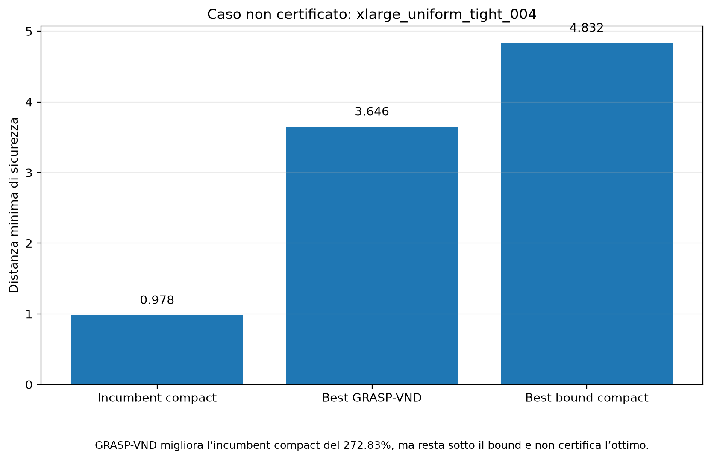

# Relazione di studio — CMMOFLP Nuclear Siting

### Ottimizzare non soltanto dove costruire, ma come distribuire responsabilità, rischio e tutela

**Autori:** Valerio Torac, Ali Shalby  
**Versione del progetto:** 1.0.0  
**Ambito:** Advanced Models and Optimization for Decision Making  
**Repository:** `BestOfTorac/CMMOFLP-Nuclear-Siting`

---

## 1. Scopo, motivazione e significato del progetto

### 1.1 La domanda da cui siamo partiti

Questo progetto nasce da una domanda semplice da formulare, ma difficile da affrontare:

> Come si può garantire l’energia necessaria a una collettività senza chiedere a una singola comunità di sopportare, da sola, il rischio maggiore?

Dietro una variabile binaria che decide se aprire un sito non esiste soltanto un punto su una mappa. Esistono territori, persone, famiglie, attività economiche e generazioni future. Per questo abbiamo scelto di non trattare la localizzazione come un esercizio puramente geometrico: il cuore del problema è trovare un equilibrio tra **bisogno energetico**, **capacità del sistema** e **protezione della comunità più esposta**.

Questa relazione ricostruisce il progetto in modo unitario con un obiettivo diverso dalla sola documentazione tecnica del repository: permettere agli autori di capire, spiegare e difendere ogni scelta compiuta, comprese le ragioni umane ed etiche che hanno guidato il lavoro.

### 1.2 Perché abbiamo scelto il tema nucleare

Abbiamo scelto la localizzazione di centrali nucleari non perché sia un tema semplice o privo di controversie, ma proprio perché obbliga a confrontarsi con decisioni reali e difficili.

Il dibattito sull’energia non riguarda soltanto quanta elettricità produrre. Riguarda anche:

- continuità e sicurezza dell’approvvigionamento;
- riduzione dell’impatto climatico della produzione energetica;
- uso responsabile del territorio;
- distribuzione equa di benefici e rischi;
- responsabilità verso chi vive oggi e verso chi verrà dopo di noi.

Una centrale produce un beneficio collettivo, ma i suoi rischi percepiti e territoriali non sono distribuiti in modo uniforme. È proprio questa asimmetria a rendere il problema interessante: tutta la società beneficia dell’energia, mentre alcune comunità possono sentirsi chiamate a sostenere il peso maggiore della scelta.

Il progetto non vuole essere propaganda a favore o contro il nucleare. Usa il nuclear siting come scenario per studiare una domanda più generale e profondamente concreta:

> Come si prende una decisione collettivamente utile senza sacrificare silenziosamente il soggetto più vulnerabile?

### 1.3 Il significato etico del maximin

La funzione obiettivo maximin non cerca la soluzione migliore “in media”. Cerca di migliorare la condizione peggiore.

Questa scelta matematica ha un significato etico preciso: una soluzione non viene giudicata soltanto dal beneficio complessivo, ma da ciò che accade alla comunità più penalizzata. In altre parole, il modello rifiuta l’idea che un buon risultato medio possa giustificare un’esposizione eccessiva concentrata su pochi.

Il criterio maximin rappresenta quindi, in forma semplificata:

- un principio di precauzione;
- un’attenzione alla giustizia territoriale;
- la tutela del soggetto più esposto;
- il rifiuto dell’idea di comunità “sacrificabili”.

Naturalmente, una formula non può decidere da sola che cosa sia giusto. Può però rendere trasparente quale valore stiamo scegliendo di privilegiare. In questo progetto abbiamo scelto di privilegiare il caso peggiore, perché una decisione pubblica è credibile solo quando considera anche chi ne sopporta il costo maggiore.

### 1.4 Che cosa studia concretamente il modello

Il progetto studia il **Capacitated Multiple Maximin Obnoxious Facility Location Problem (CMMOFLP)** in uno scenario sintetico di localizzazione di centrali nucleari. La localizzazione è “obnoxious” perché gli impianti sono considerati indesiderabili dalle comunità vicine: l’obiettivo è aprire un numero fissato di impianti massimizzando la distanza di sicurezza minima dalle comunità, senza violare i vincoli di capacità.

Il termine “obnoxious” non implica che la tecnologia sia considerata intrinsecamente negativa. Indica che, dal punto di vista localizzativo, la vicinanza dell’impianto è percepita come uno svantaggio e deve quindi essere trattata esplicitamente nella decisione.

Il lavoro comprende:

1. formalizzazione matematica;
2. modello esatto compatto in AMPL;
3. metodo esatto basato su soglie;
4. euristica greedy capacity-aware;
5. miglioramento locale con repair e 1-swap;
6. metaeuristica GRASP-VND;
7. generazione di istanze sintetiche;
8. benchmark sperimentale su 90 istanze;
9. studio di ablation;
10. stress test XXLarge;
11. pipeline riproducibile con test, analisi e grafici.

---

## 2. Il problema decisionale

### 2.1 Interpretazione intuitiva

Sono disponibili:

- un insieme di comunità che generano domanda energetica;
- un insieme di siti candidati nei quali è possibile aprire centrali;
- un numero esatto `p` di centrali da aprire;
- una capacità massima per ogni sito;
- una distanza tra ogni comunità e ogni sito.

La soluzione deve decidere:

1. quali `p` siti aprire;
2. a quale centrale assegnare la domanda di ogni comunità.

L’obiettivo non è minimizzare la distanza di servizio. Nel contesto “obnoxious”, la distanza è una misura di sicurezza: si vuole rendere il più grande possibile il caso peggiore, cioè la minima distanza tra una comunità e una centrale aperta.

### 2.2 Separazione tra sicurezza e assegnamento

Una caratteristica fondamentale del progetto è la distinzione tra:

- **scelta dei siti**, che determina il valore di sicurezza;
- **assegnamento**, che serve a verificare domanda e capacità.

Una comunità può essere assegnata a una centrale anche se non è la più vicina. L’assegnamento non modifica direttamente la funzione obiettivo: garantisce soltanto che tutte le domande siano servite e che le capacità non siano superate.

Per questo motivo, una soluzione con siti molto sicuri può comunque essere inammissibile se le loro capacità non consentono un assegnamento completo.

### 2.3 Un conflitto reale: protezione e servizio

Il modello rende visibile un conflitto che esiste in molte decisioni pubbliche. Allontanare ogni impianto il più possibile dalle comunità sembra, in astratto, la scelta più sicura. Tuttavia, gli impianti devono anche avere capacità sufficiente per sostenere la domanda.

La soluzione responsabile non è quindi quella che massimizza una sola dimensione ignorando tutte le altre. È quella che mantiene insieme due doveri:

1. **proteggere le persone**, evitando che una comunità sia eccessivamente esposta;
2. **garantire il servizio**, assicurando che la domanda energetica sia effettivamente coperta.

Questa tensione è il motivo per cui l’ottimizzazione è utile: non elimina il conflitto, ma lo rende esplicito, misurabile e verificabile.

---

## 3. Notazione matematica

### 3.1 Insiemi

- `I`: insieme delle comunità;
- `J`: insieme dei siti candidati.

### 3.2 Parametri

- `p`: numero di centrali da aprire;
- `q_i`: domanda della comunità `i`;
- `u_j`: capacità del sito `j`;
- `d_ij`: distanza tra la comunità `i` e il sito `j`.

Per ogni sito si definisce la sua sicurezza intrinseca:

```math
r_j = \min_{i \in I} d_{ij}.
```

Il valore `r_j` rappresenta la distanza del sito `j` dalla comunità più vicina. Se il sito viene aperto, non sarà possibile ottenere una sicurezza globale superiore a `r_j`.

Per un insieme di siti aperti `S`, con cardinalità `p`, la qualità è:

```math
z(S) = \min_{j \in S} r_j
     = \min_{j \in S}\min_{i \in I} d_{ij}.
```

Questa è una funzione **maximin**: si massimizza il minimo livello di sicurezza.

### 3.3 Variabili

- `y_j ∈ {0,1}`: vale 1 se il sito `j` è aperto;
- `x_ij ∈ {0,1}`: vale 1 se la comunità `i` è assegnata al sito `j`;
- `z ≥ 0`: sicurezza minima della soluzione.

---

## 4. Formulazione compatta MIP

La formulazione compatta è:

```math
\max z
```

soggetta a:

### Numero di impianti

```math
\sum_{j\in J} y_j = p.
```

Si devono aprire esattamente `p` siti.

### Assegnamento completo

```math
\sum_{j\in J} x_{ij} = 1
\qquad \forall i\in I.
```

Ogni comunità deve essere assegnata esattamente a una centrale.

### Collegamento tra assegnamento e apertura

```math
x_{ij} \le y_j
\qquad \forall i\in I,\ \forall j\in J.
```

Non si può assegnare domanda a un sito chiuso.

### Capacità

```math
\sum_{i\in I} q_i x_{ij} \le u_j y_j
\qquad \forall j\in J.
```

La domanda assegnata a ogni centrale non può superarne la capacità. Se `y_j=0`, nessuna domanda può essere assegnata al sito.

### Sicurezza maximin

```math
z \le r_j + M(1-y_j)
\qquad \forall j\in J.
```

Quando `y_j=1`, il vincolo diventa `z≤r_j`. Quando `y_j=0`, il termine Big-M disattiva il vincolo.

### Dominio

```math
x_{ij}\in\{0,1\},
\qquad
y_j\in\{0,1\},
\qquad
z\ge 0.
```

### 4.1 Perché la formulazione è corretta

Per ogni sito aperto, `z` è limitato dalla sua sicurezza `r_j`. Massimizzando `z`, il solver lo porta al minimo valore di sicurezza tra tutti i siti aperti:

```math
z = \min_{j:y_j=1} r_j.
```

I vincoli di assegnamento e capacità garantiscono contemporaneamente la fattibilità energetica.

### 4.2 Dimensione del modello

Il numero di variabili binarie è:

```math
|I||J| + |J|.
```

Il numero principale di vincoli è:

```math
|I||J| + |I| + 2|J| + 1.
```

Nel benchmark:

| Classe | Comunità | Siti | p | Variabili binarie | Vincoli |
|---|---:|---:|---:|---:|---:|
| Medium | 100 | 30 | 5 | 3.030 | 3.161 |
| Large | 300 | 75 | 10 | 22.575 | 22.951 |
| XLarge | 600 | 150 | 15 | 90.150 | 90.901 |

La crescita è dominata dalle variabili `x_ij`, quindi è proporzionale a `|I||J|`.

---

## 5. Metodo esatto a soglia

### 5.1 Idea

Poiché il valore obiettivo può assumere soltanto uno dei valori `r_j`, si può trasformare il problema di ottimizzazione in una sequenza di problemi di fattibilità.

Per una soglia `λ`, si definisce:

```math
J(\lambda)=\{j\in J:r_j\ge\lambda\}.
```

La domanda diventa:

> È possibile scegliere esattamente `p` siti in `J(λ)` e assegnare tutte le comunità senza violare le capacità?

Se la risposta è sì, `λ` è raggiungibile. Se è no, nessuna soluzione può avere sicurezza almeno `λ`.

### 5.2 Monotonicità

- se una soglia `λ` è ammissibile, tutte le soglie inferiori sono ammissibili;
- se una soglia `λ` è inammissibile, tutte le soglie superiori sono inammissibili.

Questo permette di cercare la soglia massima tra i valori candidati.

### 5.3 Vantaggi e svantaggi

**Vantaggi**

- evita una variabile obiettivo continua con Big-M;
- sfrutta la struttura discreta dei valori `r_j`;
- produce una verifica chiara della sicurezza raggiungibile.

**Svantaggi**

- richiede più solve di fattibilità;
- nel protocollo completo il numero di controlli può arrivare a `|J|`;
- sulle istanze grandi ogni verifica contiene comunque tutte le variabili di assegnamento.

Nel benchmark il numero massimo di solve di soglia per istanza è:

| Classe | Solve di soglia |
|---|---:|
| Medium | 30 |
| Large | 75 |
| XLarge | 150 |

---

## 6. Euristiche costruttive e ricerca locale

### 6.1 Greedy capacity-aware

Una strategia puramente basata sui valori `r_j` sceglierebbe i `p` siti più sicuri. Questa scelta può però risultare inammissibile rispetto alla capacità.

La greedy del progetto tiene conto contemporaneamente di:

- sicurezza del sito;
- capacità disponibile;
- possibilità di costruire o riparare un assegnamento completo.

La costruzione aggiunge progressivamente siti promettenti e verifica la compatibilità con il problema capacitated.

**Punti di forza**

- costo computazionale ridotto;
- soluzione interpretabile;
- ottimo punto di partenza per metodi più avanzati.

**Limite principale**

Una decisione presa all’inizio può impedire scelte migliori successive. Inoltre, la funzione maximin crea molti plateau: sostituire un sito che non è il peggiore può non modificare affatto l’obiettivo.

### 6.2 Repair

Il repair viene attivato quando l’insieme di siti selezionato non consente un assegnamento valido.

Il suo obiettivo non è necessariamente migliorare subito `z`, ma recuperare l’ammissibilità tramite:

- riassegnamenti;
- sostituzioni di siti;
- esplorazione limitata di combinazioni alternative;
- controllo di un limite di nodi o di tempo.

La sequenza concettuale è:

1. la costruzione cerca siti sicuri;
2. il repair ristabilisce la fattibilità capacitated;
3. la ricerca locale prova a migliorare la qualità.

### 6.3 Ricerca locale 1-swap

Il vicinato 1-swap sostituisce un sito aperto con un sito chiuso. Per ogni sostituzione si controllano:

1. fattibilità dell’assegnamento;
2. nuovo valore maximin;
3. eventuale miglioramento.

Nel benchmark finale, il 1-swap non ha migliorato nessuna delle 80 soluzioni greedy ammissibili. Il risultato non implica che il codice sia inutile o errato: mostra che, sulle istanze considerate, la greedy raggiunge spesso un ottimo locale rispetto a quel vicinato oppure che l’obiettivo maximin produce un vicinato poco informativo.

---

## 7. GRASP-VND

GRASP-VND è il metodo euristico principale del progetto.

### 7.1 Struttura generale

Ogni start comprende:

1. costruzione randomizzata;
2. verifica o repair dell’ammissibilità;
3. Variable Neighborhood Descent;
4. aggiornamento della migliore soluzione;
5. verifica dei criteri di arresto.

L’algoritmo viene ripetuto con più start e più seed.

### 7.2 Costruzione randomizzata

GRASP non seleziona sempre il candidato migliore. Costruisce una **Restricted Candidate List (RCL)** contenente siti di buona qualità e sceglie casualmente tra essi.

Questo produce un equilibrio tra:

- **intensificazione**, scegliendo siti promettenti;
- **diversificazione**, evitando che ogni esecuzione segua lo stesso percorso.

I parametri principali includono `alpha`, dimensione della candidate list, peso della sicurezza e limite sui candidati secondari.

### 7.3 VND

La Variable Neighborhood Descent esplora più vicinati con complessità crescente. Nel progetto sono utilizzate mosse mirate di:

- 1-swap;
- 2-swap.

Quando un vicinato trova un miglioramento, la ricerca riparte dal primo vicinato. Quando nessun vicinato migliora la soluzione, lo start termina.

### 7.4 Ottimizzazioni implementative

Il metodo include:

- cache delle valutazioni già effettuate;
- mosse concentrate sui siti che determinano il minimo;
- limiti per il repair;
- arresto per stagnazione;
- deadline temporale;
- upper bound di sicurezza.

Un upper bound naturale è ottenuto ordinando i valori `r_j`. Ignorando temporaneamente la capacità, la miglior sicurezza possibile con `p` siti non può superare il `p`-esimo valore più alto. Se una soluzione raggiunge questo limite ed è ammissibile, è certificata ottima senza bisogno di un solver esatto.

---

## 8. Generazione delle istanze

Il benchmark finale contiene 90 istanze sintetiche.

### 8.1 Dimensioni

| Dimensione | Comunità | Siti | Centrali da aprire |
|---|---:|---:|---:|
| Medium | 100 | 30 | 5 |
| Large | 300 | 75 | 10 |
| XLarge | 600 | 150 | 15 |

### 8.2 Distribuzioni geografiche

- **Uniform**: comunità e siti distribuiti nello spazio in modo più omogeneo;
- **Clustered**: comunità concentrate in gruppi, con una struttura spaziale più irregolare.

### 8.3 Livelli di capacità

- **Tight**: capacità complessivamente più vincolanti;
- **Medium**: difficoltà intermedia;
- **Loose**: capacità più abbondanti.

### 8.4 Disegno fattoriale

Le classi sono:

```math
3\ \text{dimensioni}
\times
2\ \text{distribuzioni}
\times
3\ \text{livelli di capacità}
=18\ \text{classi}.
```

Per ogni classe sono generate 5 repliche:

```math
18\times5=90\ \text{istanze}.
```

Questo disegno permette di separare l’effetto di scala, geometria, capacità e casualità della replica.

---

## 9. Protocollo sperimentale

I metodi finali confrontati sono:

1. compact MIP;
2. threshold exact;
3. greedy;
4. greedy + 1-swap;
5. GRASP-VND seed 42;
6. GRASP-VND best-of-5.

Le analisi distinguono:

- presenza di una soluzione ammissibile;
- ottimalità certificata;
- gap rispetto a un ottimo noto;
- runtime;
- raggiungimento dell’upper bound;
- time limit;
- errori software.

Questa distinzione evita un errore comune: confondere “solver terminato” con “ottimo certificato”.

---

## 10. Risultati del benchmark

### 10.1 Metodi esatti

Il compact MIP ha prodotto un incumbent in tutte le 90 istanze:

- incumbent disponibili: **90/90**;
- ottimi certificati: **89/90**;
- una sola istanza ha raggiunto il time limit senza certificazione.

L’istanza non certificata è `xlarge_uniform_tight_004`.

### 10.2 Baseline

Sono stati eseguiti 180 run complessivi: 90 greedy e 90 greedy + 1-swap.

Per ciascuna variante:

- istanze ammissibili: **80/90**;
- ottimi raggiunti sugli 89 ottimi noti: **75/89**.

| Metodo | Ammissibili | Ottimi noti raggiunti | Gap medio | Runtime medio |
|---|---:|---:|---:|---:|
| Greedy | 80/90 | 75/89 | 1,071617% | 0,251016 s |
| Greedy + 1-swap | 80/90 | 75/89 | 1,071617% | 0,651772 s |

Il 1-swap ha moltiplicato il runtime medio per circa **3,87**, senza recuperare istanze e senza migliorare l’obiettivo.

### 10.3 GRASP-VND

Sono stati eseguiti:

```math
90\ \text{istanze}\times5\ \text{seed}=450\ \text{run}.
```

Risultati:

- run ammissibili: **449/450**;
- run certificati tramite upper bound: **340/450**;
- istanze con almeno una soluzione ammissibile nel best-of-5: **90/90**;
- ottimi raggiunti sugli 89 casi certificati: **85/89**;
- errori software: **0**.

| Variante | Ammissibili | Ottimi noti raggiunti | Gap medio | Runtime medio |
|---|---:|---:|---:|---:|
| GRASP-VND seed 42 | 90/90 | 85/89 | 0,316316% | 2,283052 s |
| GRASP-VND best-of-5 | 90/90 | 85/89 | 0,222964% | 11,747365 s |

Il best-of-5 migliora una sola istanza rispetto al seed 42, ma non aggiunge nuovi ottimi. Il runtime sequenziale medio cresce di circa **5,45 volte**.


---

## 11. Interpretazione dei risultati

### 11.1 Perché GRASP-VND è il metodo euristico migliore

Rispetto alla greedy:

- recupera tutte le 10 istanze che la baseline non rende ammissibili;
- riduce fortemente il gap medio;
- raggiunge 10 ottimi noti in più;
- mantiene tempi contenuti rispetto ai metodi esatti.

Il miglioramento deriva soprattutto dalla costruzione diversificata e dal repair, non dal semplice 1-swap.

### 11.2 Perché il 1-swap non aiuta

Le cause plausibili sono strutturali:

- l’obiettivo dipende soltanto dal sito aperto peggiore;
- molte mosse non cambiano il minimo;
- una singola sostituzione può non bastare per superare un plateau;
- i vincoli di capacità limitano le sostituzioni ammissibili;
- la greedy produce già buoni ottimi locali.

L’ablation mostra sperimentalmente che aggiungere un componente non garantisce un miglioramento.

Questo è anche un risultato di onestà scientifica. Sarebbe stato facile raccontare soltanto i componenti che funzionano e nascondere quelli inefficaci. Abbiamo invece mantenuto e pubblicato il risultato negativo perché un progetto credibile non deve dimostrare che ogni idea iniziale era corretta: deve mostrare che ogni idea è stata verificata.

### 11.3 Valore del multi-seed

Il multi-seed aumenta la robustezza, ma nel benchmark il rendimento marginale è limitato:

- una sola soluzione migliorata;
- nessun nuovo ottimo;
- costo temporale superiore di oltre cinque volte.

Per una singola esecuzione pratica, il seed 42 offre un compromesso molto efficace. Il best-of-5 è più adatto quando la qualità conta più del tempo o quando i run possono essere parallelizzati.

---

## 12. Il caso non certificato

Per `xlarge_uniform_tight_004`:

| Quantità | Valore |
|---|---:|
| Incumbent compact al time limit | 0,977947 |
| Migliore GRASP-VND | 3,646104 |
| Best bound compact | 4,831709 |

La soluzione GRASP-VND è circa il **272,83%** migliore dell’incumbent trovato dal compact entro il limite temporale.

Questo non dimostra che GRASP-VND abbia trovato l’ottimo, perché:

```math
3,646104 < 4,831709.
```

Dimostra però che, nel caso computazionalmente più difficile, la metaeuristica trova una soluzione molto migliore dell’incumbent disponibile dal MIP.



La formulazione corretta in presentazione è:

> GRASP-VND ha trovato una soluzione molto migliore dell’incumbent MIP entro il protocollo, ma l’ottimalità dell’istanza non è certificata.

Non bisogna dire che GRASP-VND ha battuto l’ottimo.

Questo caso è importante anche sul piano metodologico. Quando il calcolo non fornisce una certificazione completa, la risposta corretta non è riempire il vuoto con una conclusione più forte dei dati. È dichiarare con precisione ciò che sappiamo e ciò che non sappiamo. La trasparenza sull’incertezza è parte integrante della responsabilità scientifica.

---

## 13. Stress test XXLarge

Lo stress test è separato dal benchmark ufficiale.

Dimensione:

- 1.200 comunità;
- 300 siti;
- `p=30`.

Risultati compact:

- incumbent: **3/3**;
- ottimi certificati: **0/3**;
- time limit: **3/3**.

Risultati GRASP-VND:

- run ammissibili: **13/15**;
- run certificati tramite upper bound: **5/15**;
- run senza incumbent entro il limite: **2/15**;
- errori software: **0**.

Lo stress test mostra che:

- la difficoltà del MIP cresce rapidamente;
- GRASP-VND continua a produrre buone soluzioni, ma non è infallibile;
- repair e limite temporale diventano critici;
- la scalabilità è promettente, ma non completamente risolta.

---

## 14. Architettura software

Il repository separa modelli matematici, logica Python, generazione delle istanze, runner sperimentali, analisi, risultati, visualizzazioni e test.

```text
configs/
    definizione delle campagne

instances/
    dati di input e istanza toy

models/
    compact.mod e threshold.mod

src/cmmoflp_nuclear_siting/
    rappresentazione del problema
    validazione
    euristiche
    metodi esatti
    esperimenti
    analisi

scripts/
    interfacce da riga di comando

results/final/
    dati grezzi e riepiloghi pubblicati

results/plots/final/
    grafici rigenerabili

tests/
    test automatici
```

La separazione evita che gli script contengano direttamente tutta la logica algoritmica e rende i componenti testabili.

---

## 15. Riproducibilità

### Installazione

```bash
python -m venv .venv
python -m pip install -e ".[dev]"
```

### Test

```bash
python -m pytest -W error::FutureWarning
```

Risultato atteso: `62 passed`.

### Rigenerazione delle istanze

```bash
python scripts/generate_instances.py --config configs/benchmark/final_benchmark.yaml --overwrite
```

### Analisi dei risultati pubblicati

```bash
python scripts/analyze_final_results.py
python scripts/analyze_ablation.py
```

### Grafici

```bash
python scripts/generate_final_plots.py
```

Gli script di analisi e visualizzazione usano i CSV pubblicati. Non è necessario possedere una licenza AMPL/Gurobi per rigenerare tabelle e grafici.

La riproducibilità non è soltanto una buona pratica tecnica. È una forma di responsabilità: permette ad altri di controllare i risultati, individuare errori, distinguere dati e interpretazioni e verificare che le conclusioni non dipendano da passaggi nascosti.

---

## 16. Verifica e qualità

Il progetto include 62 test automatici. Le categorie principali controllano:

- caricamento delle istanze;
- validazione dei dati;
- calcolo della funzione obiettivo;
- fattibilità delle soluzioni;
- comportamento delle euristiche;
- runner sperimentali;
- analisi e riepiloghi;
- casi limite.

La CI GitHub:

1. installa il package;
2. verifica l’import;
3. esegue i test;
4. considera i `FutureWarning` come errori;
5. verifica la generazione dei grafici.

La versione del package è `1.0.0`.

---

## 17. Limiti del progetto

### 17.1 Scenario sintetico

Le istanze non rappresentano località italiane reali. “Nuclear siting” è un’applicazione narrativa e sperimentale del modello.

### 17.2 Distanza come proxy di sicurezza

La sicurezza reale dipenderebbe anche da densità di popolazione, geologia, rischio sismico, disponibilità idrica, rete elettrica, costi e vincoli ambientali o normativi. Nel progetto, la distanza euclidea è una proxy semplificata.

### 17.3 Capacità e domanda semplificate

Le capacità sono statiche e la domanda è deterministica. Non sono modellati scenari temporali, incertezza, guasti, ridondanza, flussi di rete o costi di trasmissione.

### 17.4 Ottimalità non sempre disponibile

Su una delle 90 istanze il compact non certifica l’ottimo entro il time limit. I confronti con l’ottimo escludono correttamente quel caso.

### 17.5 Runtime hardware-dependent

I runtime dipendono da hardware, versione del solver e configurazione. Le conclusioni più robuste riguardano fattibilità, qualità e gap, non il valore assoluto dei secondi.

---

## 18. Responsabilità etica e ruolo dell’ottimizzazione

### 18.1 L’algoritmo non sostituisce la decisione democratica

Un modello di ottimizzazione può confrontare alternative, esplicitare vincoli e rendere coerente una scelta rispetto a un obiettivo. Non può però decidere autonomamente:

- quale livello di rischio sia socialmente accettabile;
- quali territori abbiano un valore storico o ambientale non riducibile a una distanza;
- come debba essere costruito il consenso;
- quali compensazioni siano eque;
- quali diritti non possano essere scambiati con un beneficio complessivo.

La soluzione matematica deve quindi essere interpretata come **supporto alla decisione**, non come sostituto delle istituzioni, delle valutazioni tecniche multidisciplinari o del confronto con le comunità.

### 18.2 Giustizia territoriale

Le grandi infrastrutture producono spesso benefici diffusi e costi localizzati. Il tema etico centrale è evitare che territori con minore forza politica o economica diventino automaticamente i destinatari del rischio.

Il maximin prova a rappresentare questa esigenza proteggendo la comunità nella posizione peggiore. Tuttavia, una valutazione reale dovrebbe includere anche:

- vulnerabilità socioeconomica;
- densità e composizione della popolazione;
- capacità di evacuazione;
- presenza di infrastrutture sensibili;
- impatti cumulativi già presenti sul territorio;
- partecipazione effettiva dei cittadini.

### 18.3 Responsabilità intergenerazionale

Le scelte energetiche e infrastrutturali possono produrre effetti molto più lunghi dell’orizzonte politico o economico nel quale vengono prese. Per questo una decisione responsabile deve considerare non soltanto l’efficienza immediata, ma anche il peso trasferito alle generazioni future.

Nel nostro modello questo principio non è rappresentato esplicitamente. Il progetto lo riconosce come un limite e come una direzione futura: una formulazione più realistica dovrebbe incorporare scenari temporali, gestione del rischio, costi di dismissione e conseguenze di lungo periodo.

### 18.4 Trasparenza prima della retorica

Abbiamo scelto di non trasformare un modello sintetico in una falsa simulazione del mondo reale. Le istanze non descrivono l’Italia e i risultati non indicano dove costruire una centrale.

Questa precisazione non indebolisce il progetto. Al contrario, ne definisce con onestà il contributo: studiare come metodi esatti ed euristici affrontano una decisione capacitated con obiettivo maximin e mostrare quali elementi servirebbero per trasformare il prototipo in uno strumento reale.

### 18.5 Il valore umano del progetto

Il risultato più importante non è soltanto aver raggiunto 85 ottimi noti su 89 con GRASP-VND. È aver costruito un processo nel quale:

- la comunità peggiore non viene nascosta dalla media;
- i fallimenti delle euristiche vengono pubblicati;
- l’incertezza viene dichiarata;
- i risultati sono riproducibili;
- i limiti del modello sono espliciti.

In questo senso, l’etica non è una sezione decorativa aggiunta alla matematica. È presente nel modo in cui è stata scelta la funzione obiettivo, nel modo in cui sono stati interpretati i risultati e nel modo in cui il progetto comunica ciò che può e non può dimostrare.

---

## 19. Sviluppi futuri realistici

1. integrare criteri multipli di rischio e costo;
2. usare distanze di rete anziché euclidee;
3. introdurre domanda incerta o robust optimization;
4. parallelizzare i seed GRASP;
5. aggiungere path relinking;
6. studiare vicinati ejection-chain o large neighborhood search;
7. migliorare il repair tramite flow o MIP ridotto;
8. confrontare il metodo con metaeuristiche alternative;
9. testare istanze reali o geografiche;
10. approfondire la formulazione esatta con decomposizione o symmetry breaking.

Questi sono sviluppi futuri, non parti già implementate.

---

## 20. Come presentare il progetto in 10–15 minuti

### Apertura

> Ogni scelta energetica produce un beneficio collettivo, ma non distribuisce automaticamente rischi e responsabilità in modo equo. Il nostro progetto parte da questa domanda: come garantire l’energia necessaria senza trasformare una comunità nella parte sacrificabile del sistema?

### Passaggio chiave

> La sicurezza dipende dai siti aperti; l’assegnamento serve a verificare capacità e domanda. Questa separazione guida sia i modelli esatti sia le euristiche.

### Modelli

> Abbiamo sviluppato un compact MIP e un esatto a soglia. Il primo ottimizza direttamente `z`; il secondo sfrutta il fatto che i valori possibili sono le sicurezze dei siti.

### Euristiche

> La greedy è veloce ma fallisce su 10 istanze. GRASP-VND combina costruzione randomizzata, repair e vicinati 1/2-swap e risolve tutte le 90 istanze almeno una volta.

### Risultato centrale

> GRASP-VND raggiunge 85 dei 89 ottimi certificati con gap medio dello 0,22% nel best-of-5.

### Ablation

> Il 1-swap da solo non porta miglioramenti e costa 3,87 volte di più. Il multi-seed migliora una sola istanza e non aggiunge ottimi: è utile soprattutto per robustezza.

### Chiusura

> Il progetto mostra che l’ottimizzazione può fare più che trovare una soluzione efficiente: può rendere visibile chi sopporta il caso peggiore. I metodi esatti ci danno certezza, le euristiche ci danno velocità e scala; la responsabilità resta quella di usare entrambi senza perdere di vista le persone rappresentate dai dati.

---

## 21. Domande probabili del docente

### Perché il problema è maximin?

Perché si protegge la comunità più penalizzata: il valore della soluzione è determinato dalla minima distanza da un impianto aperto.

### Perché esistono variabili di assegnamento se la distanza di assegnamento non entra nell’obiettivo?

Per garantire che tutta la domanda sia servita e che nessuna capacità venga superata.

### Perché non basta scegliere i `p` siti con `r_j` maggiore?

Perché quei siti potrebbero non avere capacità sufficiente a servire tutte le comunità.

### Perché il threshold è esatto?

Perché ogni possibile valore ottimo coincide con un valore `r_j`, e la fattibilità è monotona rispetto alla soglia.

### Che cosa certifica l’upper bound?

Ignorando la capacità, il `p`-esimo miglior valore `r_j` è un limite superiore. Una soluzione ammissibile che lo raggiunge è ottima.

### Perché GRASP e non solo greedy?

La randomizzazione permette di esplorare combinazioni diverse e superare decisioni premature della greedy.

### Perché VND?

Perché usa più strutture di vicinato e può superare ottimi locali di un singolo vicinato.

### Il best-of-5 è sempre preferibile?

No. Ha gap medio leggermente migliore ma costa circa 5,45 volte il seed singolo e non trova nuovi ottimi nel benchmark.

### Potete affermare che H2 è migliore del compact?

Non in generale. Il compact fornisce certificazioni di ottimalità; GRASP-VND fornisce rapidamente soluzioni di alta qualità. Sull’unico caso non certificato H2 trova un incumbent migliore, ma non ne dimostra l’ottimalità.

### I risultati valgono per centrali reali?

No. Le istanze sono sintetiche e la distanza è una proxy semplificata. Il contributo è algoritmico e sperimentale.

### Perché avete inserito una motivazione etica in un progetto di ottimizzazione?

Perché la funzione obiettivo non è neutrale: decidere di massimizzare il minimo significa scegliere di proteggere il soggetto più penalizzato invece di ottimizzare soltanto una media. Dichiarare questa scelta rende il modello più trasparente.

### Un algoritmo può decidere dove costruire una centrale?

No. Può supportare il confronto tra alternative, ma una decisione reale richiede dati multidisciplinari, valutazioni ambientali, normativa, analisi del rischio, partecipazione pubblica e responsabilità politica.

### Il progetto è a favore del nucleare?

Il progetto non assume una posizione propagandistica. Usa il nuclear siting come caso difficile per studiare il rapporto tra fabbisogno energetico, capacità e protezione delle comunità.

---

## 22. Glossario essenziale

**Ammissibile:** soluzione che rispetta tutti i vincoli.  
**Incumbent:** migliore soluzione ammissibile trovata finora da un solver.  
**Best bound:** limite usato dal solver per valutare quanto può ancora migliorare.  
**Ottimo certificato:** soluzione per la quale il gap di ottimalità è chiuso.  
**Gap:** distanza percentuale da un ottimo o bound di riferimento.  
**Maximin:** massimizzazione del valore minimo.  
**Obnoxious facility:** impianto indesiderabile che si preferisce lontano dalla popolazione.  
**GRASP:** costruzione greedy randomizzata ripetuta, seguita da ricerca locale.  
**VND:** esplorazione ordinata di più vicinati.  
**Repair:** procedura che recupera la fattibilità.  
**1-swap:** sostituzione di un sito aperto con uno chiuso.  
**2-swap:** sostituzione di due siti aperti con due chiusi.  
**Ablation:** esperimento che misura l’effetto di singoli componenti.  
**Time limit:** arresto imposto prima della certificazione completa.

---

## 23. Conclusioni

Il progetto realizza una pipeline completa per il CMMOFLP:

- formulazione del problema;
- due approcci esatti;
- tre livelli euristici;
- generazione controllata delle istanze;
- benchmark fattoriale;
- validazione statistica e grafica;
- test e riproducibilità.

I risultati principali sono:

- compact con incumbent su 90/90 e certificazione su 89/90;
- greedy ammissibile su 80/90;
- GRASP-VND ammissibile su tutte le istanze nel best-of-5;
- 85/89 ottimi certificati raggiunti;
- gap medio best-of-5 pari a 0,222964%;
- nessun beneficio qualitativo del semplice 1-swap;
- limitato rendimento marginale del multi-seed;
- forte vantaggio euristico sull’incumbent del caso MIP non certificato.

La conclusione più importante non è che un metodo domini sempre gli altri. I metodi esatti forniscono certificazione; le euristiche forniscono velocità, robustezza e scalabilità. Il valore tecnico del progetto sta nell’aver costruito e valutato entrambi in modo coerente e riproducibile.

Il suo valore più profondo, però, sta nella domanda che rimane aperta oltre i numeri: **come possiamo prendere decisioni necessarie senza rendere invisibile chi ne sopporta il rischio maggiore?**

Il modello non offre una risposta definitiva e non pretende di farlo. Offre un linguaggio rigoroso per non evitare la domanda. Trasforma il “caso peggiore” da dettaglio marginale a centro della decisione, pubblica anche i risultati negativi e distingue con onestà tra ciò che è stato dimostrato e ciò che resta incerto.

È questo il senso con cui vogliamo presentare il progetto: non soltanto un esercizio di programmazione matematica, ma un tentativo di mostrare come rigore algoritmico, trasparenza scientifica e responsabilità verso le persone possano far parte dello stesso lavoro.
