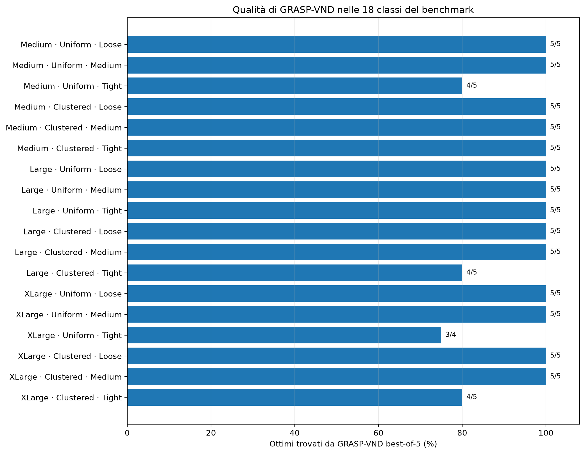

# Risultati

## Test automatici

La versione analizzata supera:

\[
62/62
\]

test automatici, sia localmente sia tramite GitHub Actions.

## Pilot tiny/small

### Metodi esatti

Compact e threshold:

- 36/36 istanze risolte;
- stesso obiettivo;
- stessi siti aperti.

Il threshold è risultato circa 4,85 volte più lento end-to-end e 5,66 volte più lento nel tempo solver.

### Greedy

- 35/36 ammissibili;
- 32/36 ottime;
- 3 subottime;
- 1 fallimento;
- gap massimo 58,67%.

### Repair + 1-swap

- 36/36 ammissibili;
- 33/36 ottime.

### GRASP-VND

Su 180 run:

- 180/180 ammissibili;
- 180/180 ottime;
- 150/180 certificate tramite upper bound.

## Calibrazione

L’arresto dopo 20 start consecutivi senza miglioramento ha mantenuto tutte le soluzioni ottime e ha ridotto:

- runtime di circa 46,4%;
- start completati di circa 74,5%.

Sulle 6 istanze XLarge di calibrazione:

- compact 6/6 ottime;
- GRASP-VND 30/30 ammissibili e uguali all’ottimo;
- 25/30 certificate tramite upper bound.

## Benchmark finale

### Modello compatto

| Dimensione | Incumbent | Ottimi certificati | Runtime medio |
|---|---:|---:|---:|
| Medium | 30/30 | 30/30 | 0,576 s |
| Large | 30/30 | 30/30 | 2,367 s |
| XLarge | 30/30 | 29/30 | 11,934 s |
| **Totale** | **90/90** | **89/90** | **4,959 s** |

L’unico time limit è avvenuto su:

```text
xlarge_uniform_tight_004
```

### Baseline

| Metodo | Ammissibili | Ottime su 89 ottimi noti | Gap medio | Runtime medio |
|---|---:|---:|---:|---:|
| Greedy | 80/90 | 75/89 | 1,072% | 0,251 s |
| Greedy + 1-swap | 80/90 | 75/89 | 1,072% | 0,652 s |

Tutti i fallimenti appartengono a classi `tight`.

### GRASP-VND per run

| Dimensione | Run | Ammissibili | Ottime con riferimento noto | Certificate UB | Runtime medio |
|---|---:|---:|---:|---:|---:|
| Medium | 150 | 150 | 145/150 | 115 | 0,099 s |
| Large | 150 | 150 | 145/150 | 115 | 1,348 s |
| XLarge | 150 | 149 | 134/145 | 110 | 5,601 s |

Totale:

- 449/450 run ammissibili;
- 340 certificazioni tramite upper bound;
- 95 arresti per stagnazione;
- 14 time limit con incumbent;
- 1 time limit senza incumbent;
- 0 errori software.

### GRASP-VND best-of-5

| Dimensione | Istanze ammissibili | Ottime su ottimi noti | Gap massimo |
|---|---:|---:|---:|
| Medium | 30/30 | 29/30 | 13,385% |
| Large | 30/30 | 29/30 | 2,341% |
| XLarge | 30/30 | 27/29 | 3,043% |

Complessivamente:

\[
85/89=95,51\%
\]

delle istanze con ottimo noto vengono risolte all’ottimo dal best-of-5.



Il dettaglio per classe conferma che le perdite di qualità si concentrano soprattutto nelle configurazioni `tight`, mentre tutte le classi `loose` e `medium` vengono risolte quasi sempre all’ottimo.

## Ablation study

Varianti:

1. greedy;
2. greedy + 1-swap;
3. GRASP-VND seed 42;
4. GRASP-VND best-of-5.

| Variante | Ammissibili | Ottime su 89 | Gap medio | Runtime medio |
|---|---:|---:|---:|---:|
| Greedy | 80/90 | 75 | 1,072% | 0,251 s |
| Greedy + 1-swap | 80/90 | 75 | 1,072% | 0,652 s |
| GRASP-VND seed 42 | 90/90 | 85 | 0,316% | 2,283 s |
| GRASP-VND best-of-5 | 90/90 | 85 | 0,223% | 11,747 s |


Il confronto mostra due risultati netti: il 1-swap isolato aumenta il tempo senza migliorare la greedy, mentre GRASP-VND riduce sensibilmente il gap e raggiunge la piena ammissibilità. Il best-of-5 migliora leggermente il gap medio rispetto al singolo seed, ma richiede un tempo medio molto maggiore.

### Effetto del 1-swap isolato

- 0 istanze recuperate;
- 0 migliorate;
- 80 invariate;
- 10 fallite con entrambi i metodi;
- costo medio circa 3,87 volte la greedy.

### Effetto del multi-seed

Dal seed 42 al best-of-5:

- 0 istanze recuperate;
- 1 migliorata;
- 89 invariate;
- 0 nuovi ottimi;
- costo medio circa 5,45 volte superiore.

Le cinque run sono utili per valutare stabilità e variabilità. Per l’impiego pratico una singola run è la configurazione più efficiente.

## Caso non certificato

Per `xlarge_uniform_tight_004`:

| Valore | Risultato |
|---|---:|
| incumbent compact | 0,977947 |
| best bound compact | 4,831709 |
| best GRASP-VND | 3,646104 |
| miglioramento H2 sull’incumbent | 272,83% |
| distanza bound–H2 rispetto a H2 | 32,52% |


GRASP-VND trova una soluzione molto migliore dell’incumbent compact, ma l’ottimalità non può essere dichiarata.

## Stress test XXLarge

Le istanze XXLarge hanno 1200 comunità e 300 siti.

### Compact

- 3/3 incumbent;
- 0/3 ottimi certificati;
- 3 time limit;
- tempo solver medio circa 61 secondi.

### GRASP-VND

Su 15 run:

- 13/15 ammissibili;
- 5/15 certificate;
- 8 time limit con incumbent;
- 2 time limit senza incumbent;
- 0 errori software.

Lo stress test mostra i limiti dei metodi senza far parte del benchmark principale.

## Conclusioni

1. Le capacità `tight` sono il principale fattore di difficoltà.
2. La greedy è rapida, ma può fallire e produrre gap elevati.
3. Il 1-swap isolato non aggiunge valore alla greedy.
4. GRASP-VND aumenta nettamente fattibilità e qualità.
5. Il compact rimane efficace fino alle XLarge, ma il tempo cresce sulle classi tight.
6. L’upper bound H2 è valido ma non sempre stretto: alcune soluzioni ottime non vengono certificate direttamente.
7. Il best-of-5 riduce leggermente il gap medio, ma non aumenta il numero di ottimi rispetto al seed 42.
8. Gli stress test mostrano limiti realistici e non errori software.

## Riproduzione

```bash
python scripts/analyze_final_results.py
python scripts/analyze_ablation.py
python scripts/generate_final_plots.py
```

I comandi predefiniti leggono `results/final/raw/` e rigenerano le tabelle versionate in `results/final/summary/` e `results/final/ablation/`. I gap reali sono calcolati soltanto quando il compact certifica l’ottimo.
